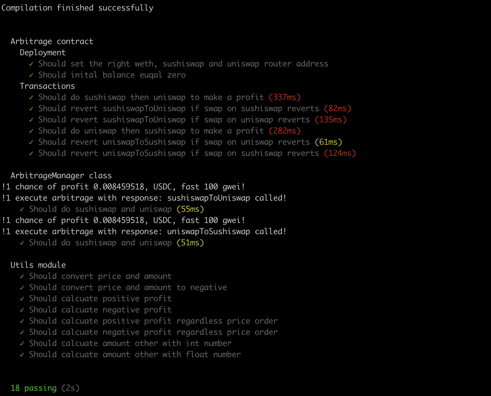

# 简要说明
在scripts/arbitrage目录里面是价格订阅、判断有没有利润以及执行arbitrage的主要逻辑。contracts下面是确保两次swap原子交易的代理合约。test目录下的单元测试包括脚本的单元测试以及代理合约的单元测试。exec-arbitrage.ts是执行脚本，价格订阅已经在以太坊主网测试过，执行arbitrage部分未在主网测试过。在利润判断部分，本项目选择币本位，即以ETH计价，判断是否有利润。选择ETH计价，是因为gas是以ETH计算的，如果以USD计价，需要把gas转化成USD。因为每天的ETH的价格都在波动，那把gas转化成USD的时候，用之前ETH买入价还是当前ETH价格来算都会有一些问题。所以选择ETH币本位并且有一边一定是WETH的交易对。未来L2，例如zksync，允许USDC来结算gas的时候可以再考虑USD计价。gas price通过onchain以及offchain的oracle综合获取。另外还有以下几点需要额外说明：
## 1 价格对
理论上来说，本项目是可以订阅所有sushiswap和uniswap有交叉的一边是WETH的交易对的价格，然后判断最优交易对。但是typescript毕竟是单线程的，订阅几百上千交易对，会大大增加处理延迟。如果是单脚步还是慎重考虑交易对的数量。如果把价格订阅单独拉出来，几百上千个交易对，问题应该是不大的。
## 2 测试
由于时间有限，目前单元测试的覆盖率并非100%，只是覆盖了一些主要链路。如果真的要上以太坊主网，需要更多的单元测试，集成测试，甚至还要仿真测试。
## 3 低延迟
低延迟是成败的关键。跟传统高频交易一样，低延迟决定了最后的成败。这可能需要一个高质量的provider或者自己运行一个light node等。


# 操作说明
## 1 安装node 16.13.0
如果是macos可以官方网站下载nodejs 16.13.0 https://nodejs.org/en/download/ \
ubuntu可以通过执行以下命令安装特定版本的node
```shell
sudo apt install nodejs
sudo apt install npm
sudo npm install -g n
sudo n 16.13.0
```
## 2 确定node版本
```
node -v
```
## 3 安装依赖
```
npm install
```
## 4 执行测试用例
```
npx hardhat test
```

## 5 关于exec-arbitrage.ts
### 5.1 在以太坊主网执行价格订阅
#### 在项目根目录新建.env文件，配置内容如下，注意需要配置正确的INFRA_PROJECT_ID
```
NETWORK = 'mainnet'
INFRA_PROJECT_ID = 'xxxxxxxxxxxxxxx'
S_FACTORY_ADDRESS = '0xC0AEe478e3658e2610c5F7A4A2E1777cE9e4f2Ac'
U_FACTORY_ADDRESS = '0x1F98431c8aD98523631AE4a59f267346ea31F984'
WETH_ADDRESS = '0xC02aaA39b223FE8D0A0e5C4F27eAD9083C756Cc2'
TOKEN_OTHER_ADDRESSES = '0xA0b86991c6218b36c1d19D4a2e9Eb0cE3606eB48,0x2260fac5e5542a773aa44fbcfedf7c193bc2c599,0xdac17f958d2ee523a2206206994597c13d831ec7'
```
#### 执行exec-arbitrage.ts
```
npx ts-node ./scripts/exec-arbitrage.ts
```

### 5.2 执行arbitrage
由于执行arbitrage需要在主网部署Arbitrage智能合约，而且需要funding的钱包里面有足够的ETH，相关代码未在主网测试过，所以在exec-arbitrage.ts里面被注释掉了。
